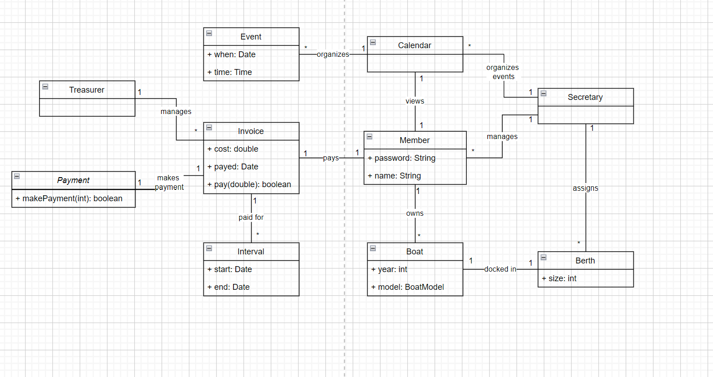

Given the folowing user cases; the class/'s responsible for fulfilling the user case will follow.

1 Authenticate : Secretary, using Member and User Input

2 Pay Membership Fee : Member, using Invoice

3 View Member Profile Information : Member or Secretary, using Member

4 Register Boat : Member, using Boat

5 Remove a Boat : Member or Secretary, using Member

6 Change a boat : Member or Secretary, using Member

7 Send Payment Reminder : Treasurer, using Invoice

8 Assign Berths : Secretary, using Berth and Member

9 List Berths : Secretary, using Secretary

10 Manage Calendar Events : Secretary, using Calendar

11 List Calendar Events : Member or Secretary, using Calendar

12 View Calendar Events : Member or Secretary, using Calendar

13 Update Payment Status : Treasurer or Member, using Invoice to pay

14 Update Invoice Status : Treasurer or Member, using Invoice to pay